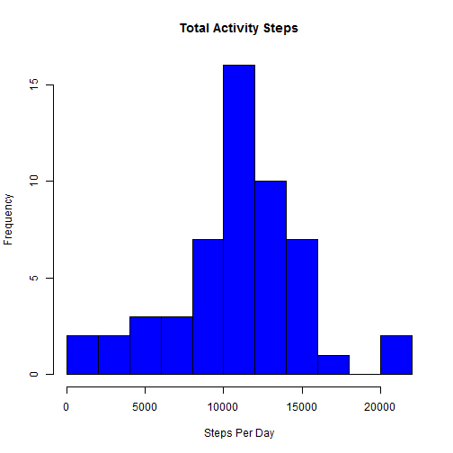
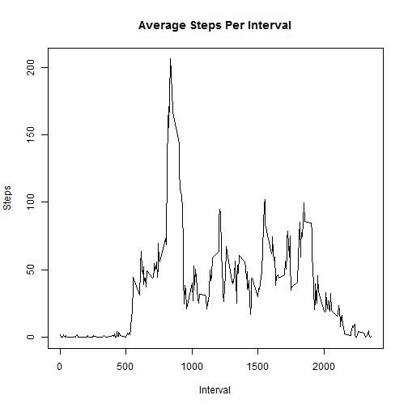
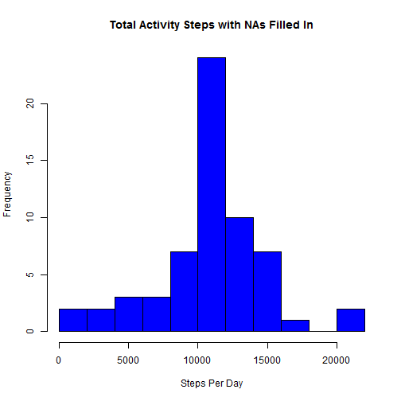
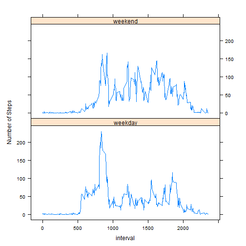

* Before we can begin, we must load the data


```r
activityData <- read.csv("activity.csv")
```

* Now process the data so it can be analysed. This means
* removing the NAs. The interval is not included here.


```r
totSteps <- aggregate(steps ~ date, data = activityData, sum,
                      na.rm = TRUE)
```

* Now that the data is ready for analysis, we can answer the following:   


#### Q1. What is the total mean number of steps taken per day?   


* First, let's make a histogram of the total number of steps


```r
hist(totSteps$steps, col = "blue", main = "Total Activity Steps",
     xlab = "Steps Per Day", breaks = 10)
```

 

* Now we calculate the __mean__ and __median__ of the total steps per day


```r
mean(totSteps$steps)
```

```
## [1] 10766
```

```r
median(totSteps$steps)
```

```
## [1] 10765
```

* The total __mean__ number of steps taken per day is:
1.0766 &times; 10<sup>4</sup> steps.
    
* The total __median__ number of steps taken per day is: 10765 steps.

#### What is the average daily activity pattern?   

* Create a time-series plot of the average number of steps taken with a five-minute interval (x), across all days (y).


```r
intervalSteps <- aggregate(steps ~ interval, data=activityData,
                           mean, na.rm = TRUE)
plot(intervalSteps, type = "l", main = "Average Steps Per Interval",
     ylab = "Steps", xlab = "Interval")
```

 

#### Which 5-minute interval, on average, contains the maximum number of steps across all the days in the dataset?


```r
intervalSteps[which.max(intervalSteps$steps),]$interval
```

```
## [1] 835
```

The 835th interval, on average, contains the maximum number of steps across all the days in the dataset.

#### Imputing missing values   

* Calculate and report the total number of missing values in the dataset (i.e. the total number of rows with NAs)


```r
sum(is.na(activityData$steps))
```

```
## [1] 2304
```

A total of 2304 rows contain missing data values.

* Devise a strategy for filling in all of the missing-value data. It need not be sophisticated.

* I decided to use the mean for the 5-min interval. Seemed the simplest of the bunch.  To accomplish this task, a function was created to obtain the mean number of steps for an interval.


```r
intervalStepsND <- function(interval) {
        
        intervalSteps[intervalSteps$interval==interval, ]$steps
        
        }
```

* Create a new dataset equal to the original dataset, but with the missing data included (filled in).

* Here, I will use a 'for loop' to fill in the missing data values (fingers crossed...)


```r
activityNewData <- activityData
count = 0  # Counts the number of data filled in
for(i in 1:nrow(activityNewData)) {
        
        if(is.na(activityNewData[i,]$steps)) {
                
                activityNewData[i,]$steps <- intervalStepsND(activityNewData[i, ]$interval)
                count = count + 1
                
        }
}
```
* Now make a histogram of the total number of steps taken each day. Calculate and report the mean and median number of steps taken per day.


```r
totStepsND <- aggregate(steps ~ date, data = activityNewData, sum)

hist(totStepsND$steps, col = "blue", main = "Total Activity Steps with NAs Filled In",
     xlab = "Steps Per Day", breaks = 10)
```

 

```r
mean(totStepsND$steps)
```

```
## [1] 10766
```

```r
median(totStepsND$steps)
```

```
## [1] 10766
```
* The total __mean__ number of steps taken per day is: 
    1.0766 &times; 10<sup>4</sup>.
    
* The total __median__ number of steps taken per day is: 
    1.0766 &times; 10<sup>4</sup>.

* Do these values differ from the estimates from the first part of the assignment? What is the impact of imputing missing data on the estimates of the total daily number of steps?

* The mean value is the same as the value before imputing missing data. The median value shows no significant difference, however, the median is dependent upon the locations of the now included missing values.


#### Are there differences in activity patterns between weekdays and weekends?   

* Create a new factor variable in the dataset with two levels - __weekday__ and __weekend__ indicating whether a given date is a weekday or weekend day.

* For this portion, data transformation is needed to perform the analyses. Will use as.POSIXlt


```r
activityNewData$day=ifelse(as.POSIXlt(as.Date(activityNewData$date))$wday%%6==0, "weekend", "weekday")

#' Make Saturday and Sunday - weekend. All others are weekday.

activityNewData$day=factor(activityNewData$day, levels=c("weekday", "weekend"))
```

* Make a panel plot containing a time series plot of the 5-minutes interval (x-axis) and the average number of stemps taken, averaged across all weekday days or weekend days (y-axis).


```r
intervalActivity=aggregate(steps ~ interval + day,  activityNewData, mean)

#' Importing lattice into the library for plotting

library(lattice)

#' Now construct the time series plot

xyplot(steps ~ interval|factor(day), data=intervalActivity, aspect = 1/2, type ="l", ylab="Number of Steps", xlab="interval")
```

 

It would appear that people are more consistent with activity on the weekend than during the week.  This would make sense as more people are relatively sedintary during the work day and will more than likely walk (or exercise) for a shorter period of time. Any walking completed outside of the office during the work week will be close to the office location to get lunch or coffee.

